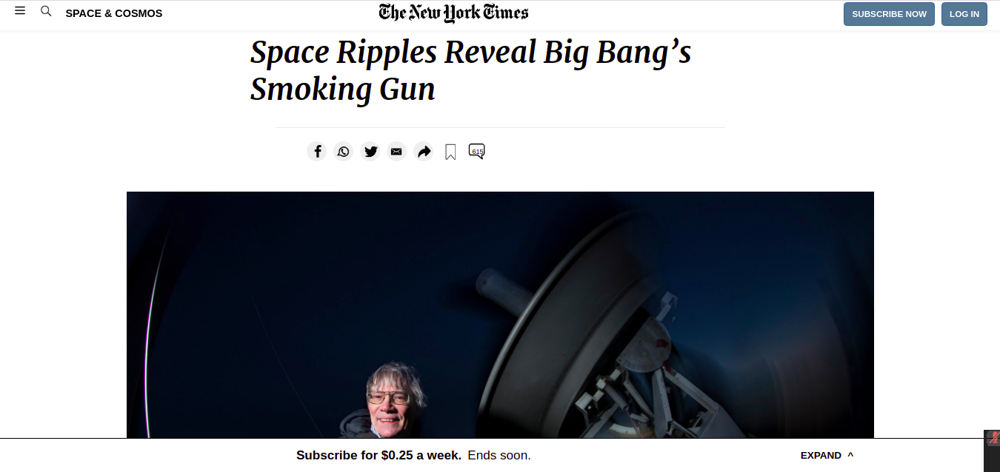

# Project Name

This is my first project in Microverse, the purpose of it is to replicate an article from the New York Times website using HTML and CSS3 skills,focused on the layout, positioning and floating.

Additional description about the project and its features.

## Built With

  - Built With HTML and CSS3
  - No other languages used
  - Applied the use of Linters for HTML and CSS3

## Live Demo

[Live Demo Link](https://alexjustalex2020.github.io/newyorktimes/)

## Getting Started

** There's no need to install anything in order to see this project. By clicking on the live demo link you should be able too see the full website. **

To get a local copy up and running follow these simple example steps:

  - Just clone this repository to your local files - there's no further installation/setup needed
  - Images may not load properly

### Prerequisites

  - None

## Author

👤 **Author**

- GitHub: [@AlexJustAlex2020](https://github.com/AlexJustAlex2020/)
- Twitter: [@Alexand81099721](https://twitter.com/Alexand81099721)
- LinkedIn: [AlexanderMorales](https://www.linkedin.com/in/alexander-morales-b8539898/)

## 🤝 Contributing

Contributions, issues, and feature requests are welcome!

Feel free to check the [issues page](../../issues/).

## Show your support

Give a ⭐️ if you like this project!

## 📝 License

This project has not been licensed.
